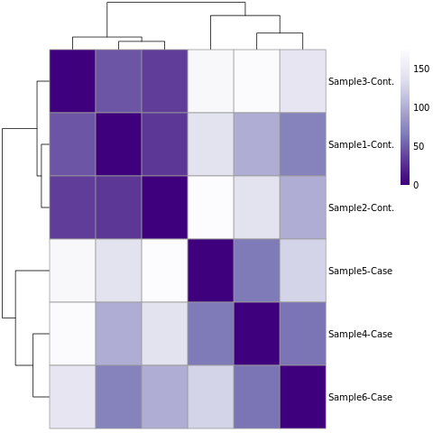
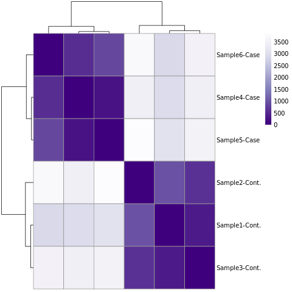

# About 

This notebook contains, in chronological order, the results of the performed experiments. Besides a description of the result it contains reflections, e.g ideas about why the result deviates from the expected results, about each experiment.

Each entry in this notebook should include which date the experiment was performed and the name of the author of the entry. Each entry should also refer to where the resulting graph, table etc can be found. 

## Sebastian (2019-02-26)

### Creation of count matrix 

Created the count-matrix for *E. coli* and the plasmid using the *summarizeOverlaps* function from the *GenomicAlignments* alignments package in R. Since the original paper didn't provide any info regarding reads overlapping multiple features the union overlapping mode was chosen, see a description [here](https://www.bioconductor.org/packages/devel/bioc/vignettes/GenomicAlignments/inst/doc/summarizeOverlaps.pdf). Basically the union mode discards all reads that overlaps two features (in this case genes). The reason behind this is that it felt a reasonable assumption to assume no overlap. However if this assumption is wrong (and they didn't assume it in the study) it might explain possible deviations from the original study. 

### Heat map Poisson distance (plasmid)

Created a Heat-map of based on the Poisson-distance for the Plasmid (Result/Figures/Pois_dist_heat_plasmid.pdf), see figure below: 

There are no big surprises in this picture. As expected the three control samples (sample 1-3) cluster together, and the same goes for the imipenem exposed samples. Judging by the color intensity (describes the Poisson distance) it seems that the three control cases are more similar to each other than the imipenem exposed samples. 

## Martina (2019-02-27)

### Filtering the data (E.coli)

Following recommendations of a minimal filtering standard, rows  with 1 or less counts were removed. This might not be strict enough, but since later analysing methods will ignore insufficient data it was concidered enough for now. 

### Heat map Poisson distance (E.coli)

Created a Heat-map based on the Poisson distance for E.coli (Result/Figures/Pois_dist_heat_E_coli.pdf), see figure below.

The figure is as expected with clear clustering of controls and case samples. Compared to the plasmid heat map, the similarity within the controls, respectively within the case samples, is even stronger with more intense colours.

