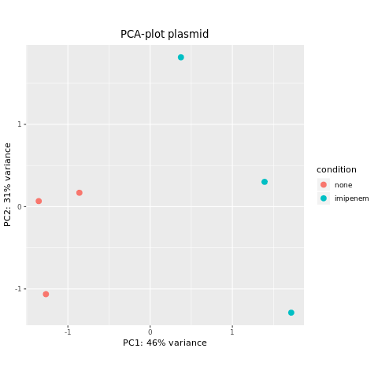
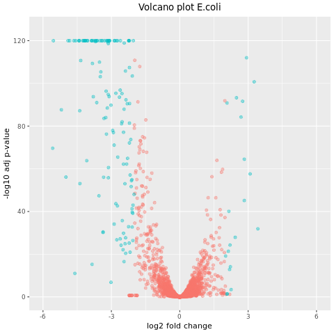

# About 

This notebook contains, in chronological order, the results of the performed experiments. Besides a description of the result it contains reflections, e.g ideas about why the result deviates from the expected results, about each experiment.

Each entry in this notebook should include which date the experiment was performed and the name of the author of the entry. Each entry should also refer to where the resulting graph, table etc can be found. 

## Sebastian (2019-02-26)

### Creation of count matrix 

Created the count-matrix for *E. coli* and the plasmid using the *summarizeOverlaps* function from the *GenomicAlignments* alignments package in R. Since the original paper didn't provide any info regarding reads overlapping multiple features the union overlapping mode was chosen, see a description [here](https://www.bioconductor.org/packages/devel/bioc/vignettes/GenomicAlignments/inst/doc/summarizeOverlaps.pdf). Basically the union mode discards all reads that overlaps two features (in this case genes). The reason behind this is that it felt a reasonable assumption to assume no overlap. However if this assumption is wrong (and they didn't assume it in the study) it might explain possible deviations from the original study. 

### Heat map Poisson distance (plasmid)

Created a Heat-map of based on the Poisson-distance for the Plasmid (Result/Figures/Pois_dist_heat_plasmid.pdf), see figure below: 

There are no big surprises in this picture. As expected the three control samples (sample 1-3) cluster together, and the same goes for the imipenem exposed samples. Judging by the color intensity (describes the Poisson distance) it seems that the three control cases are more similar to each other than the imipenem exposed samples. 

## Sebastian (2019-02-27)

### PCA-plot plasmid

Created a PCA plot from the vts-transformed data for the plasmid (Result/Figures/PCA_plasmid.pdf), see figure below.

As seen in the figure the two sample groups are separated from each other. This results corresponds well with the two sample heat-map for the plasmid, where there is a distinct clustering of the sample groups. 

## Martina (2019-02-27)

### Filtering the data (E.coli)

Following recommendations of a minimal filtering standard, rows  with 1 or less counts were removed. This might not be strict enough, but since later analysing methods will ignore insufficient data it was concidered enough for now. 

### Heat map Poisson distance (E.coli)

Created a Heat-map based on the Poisson distance for E.coli (Result/Figures/Pois_dist_heat_E_coli.pdf), see figure below.

The figure is as expected with clear clustering of controls and case samples. Compared to the plasmid heat map, the similarity within the controls, respectively within the case samples, is even stronger with more intense colours.

### PCA plot (E.coli)

Created a PCA plot from the vts-transformed data for E.coli (Result/Figures/PCA_E_coli.pdf), see figure below.

There is a clear seperation of the controls and case samples, with 89% of the variance explained by the first principal component. Nothing unexpected.

### Differential expression analysis (E.coli)

With the DESeq function in R and a set adjusted p-value of 0.05, a table of 1520 significant differentially expressed genes was created. The table will later be uploaded to Github. The original study resulted in 1563 significant genes, which is close to the result from this analysis. The most significant genes in the original study were the same as the ones found in this analysis, although the order was slightly different. Also the number of up-regulated, respectively down-regulated, significant genes was similar to the original study. The deviation of the results can be traced before the differential expression analysis, where the data used in our analysis had a total of 4251 genes while the original report had a total of 4550. The differences in the order of most significant genes could be due to using different processing or analysing steps, since these were not specified in the original report. In general, the results obtained are however satisfactory.

## Sebastian (2019-02-28)

### Volcano plot (Plasmid)

A volcano plot of the genes for the plasmid is presented below. Only genes with a p-value below 0.05 and log2 fold-change above 0.5 are given a special color. As noted none of the genes have a log2 fold-change above 2.0, which corresponds well with the original paper. 

Comparing the two volcano plots one can clearly see far more significant genes in the *E. coli* vs the plasmid. At first glance this seems surprising, but it probably depends on the plasmid being expressed at a lower level than the *E. coli* genes (should check this). The p-value (and the fold-change) depends on the expression level for a fixed sample-size, if the expression level is lower it will we smaller differences and a Wald-test will consequently have a harder time to distinguish a true effect from the noise in the data. Thus to actually get more significant plasmid genes (and a better characterization of it) a large sample-size would be preferred. 

### Histogram of p-values (Plasmid)

A histogram of the p-values (non adjusted) for the plasmid is presented below. The data looks approximately uniform for the larger p-values (harder to tell than for *E. coli* due to sample size). An approximate uniform distribution is preferred since the p-value is uniformly distributed under the null hypothesis. Note that the p-values to the left corresponds to the situation when the null hypothesis is rejected. 

## Martina (2019-02-28)

### Volcano plot (Ecoli)

Created a volcano plot for E.coli (Results/Figures/Volcano_E_coli.png) with the results seen in the figure below. Blue genes correspond to the significant differentially expressed genes with a log fold2-change larger than +- 2. The genes to the right are up-regulated while the genes to the left are down-regulated.

### Histogram of p-values (E.coli)

Created a histogram of the p-values for the expressed genes (Results/Figures/Histogram_pvalues_E_coli). This was done to check that their distribution is approximately uniform. As can be seen in the figure below, this holds for  p-values > 0.05.

